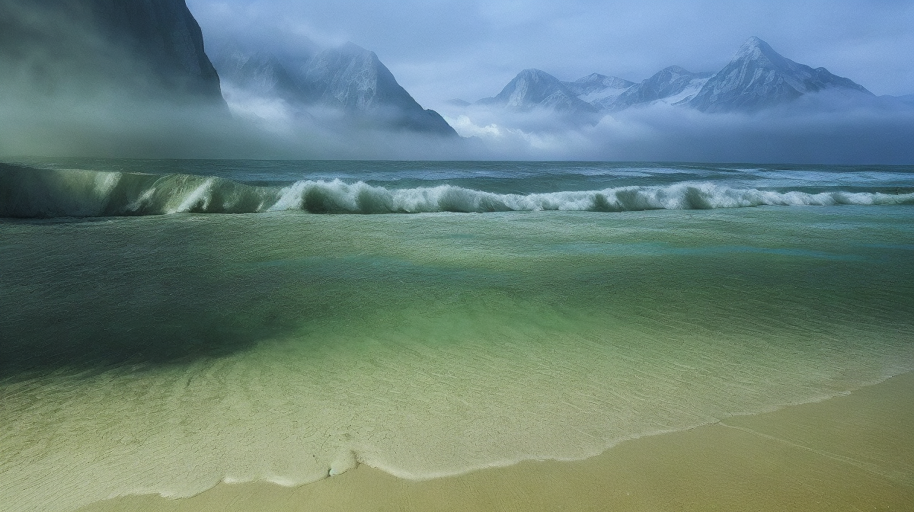

# Merge Latents

Take two images like this:
| image 1 | image 2 |
|---------|---------|
|||

And merge them in latent space to produce something combining the visual and conceptual elements:
| Merged in latent space (1) | Merged in latent space (2) | 
|------------|------------|
|||

For comparison - if you merge the images in pixel space instead of latent space (and do everything else the same) you get this (much less interesting IMHO):
| Merged in pixel space (1) | Merged in pixel space (2) | 
|------------|------------|
|||

This is a workflow and some custom nodes to combine two images by merging them in latent space and then denoising. Drag and drop either of the "merged in latent space" images onto ComfyUI to get the workflow, or get the [JSON file](merged_latent_images/merge-latents-and-prompts-workflow.json). You will need [cg_custom_nodes](https://github.com/chrisgoringe/cg_custom_nodes), which support this and other interesting workflows.

## How it works

- Conditioning
    - Describe the images with BLIP
        - this is optional (you could just provide text descriptions)
    - clip encode the descriptions
    - merge the resulting conditionings using the specified weight
- Latent
    - VAE encode the two images
    - merge the resulting latents using the specified weight
- First sampler
    - Standard (img2img style) KSampler using the mixed conditioning and mixed latents
- Second sampler
    - A second img2img run on the output of the first sampler (with the same conditioners)

## The settings

- `latent2weight`
    - How much weight to give the second image. 
    - 0.0 -> just use first image
    - 1.0 -> just use second image
    - typically between 0.4 and 0.6
- `denoise_stage1`
    - the denoise parameter for the first sampler
    - higher values will give a more 'finished' image, lower values will often give blurry results
    - typical value around 0.4
- `denoise_stage2`
    - the denoise for the second sampler
    - can be used to 'clean up' the first output if needed
    - typical value around 0.4

## Unusual nodes and where to find them

This uses a few custom nodes:

- `CG > latents > MergeLatents`
The node titled `Mix Latents` in the workflow. This is the core of the process; it takes two latents (which must be the same size - that is, derived from the same size of image) and mixes them according to the specified weight.

- `CG > latents > MergeLatentsSettings`
A convenience class for setting the merge weight and the two denoising parameters in one place.

- `conditioning > Conditioning (Average)`
This one is built in (titled `MixPositiveConditionings` on the workflow). But the name `Average` might be misleading, it's a weighted average. Note that it uses weight the other way around to the custom node (the parameter is the weight of the first conditioning). That's why the two conditioning inputs are crossed over...

- `CG > blip > TextDescriptionOfImage`
The two nodes titled `Text Description`. This does what it says on the box - generates a text description of the input image, using BLIP. Credit to Paulo Coronado's [ComfyClipBlipNode](https://github.com/paulo-coronado/comfy_clip_blip_node), of which this is a simplified version. You can remove this if you prefer to specify the text descriptions yourself.

## Other helpful nodes

If the images are not the same size, or very large, or not multiples of 8 pixels, you may find the following nodes helpful:

- `CG > Images > ImageSize`
    - take an image and output its width and height (and colour depth, and batch size)
- `CG > Images > ExactResizeImage`
    - resize to a specific size. Using the output of ImageSize above, can be used to make sure two images are the same size.
- `CG > Images > ResizeImage`
    - this one is useful for images which are really big or aren't a multiple of 8 pixels.

